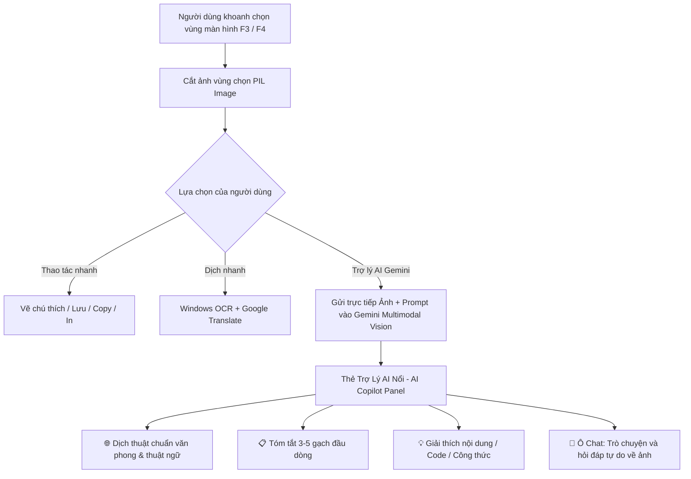

# KẾ HOẠCH NÂNG CẤP MYSHOT: TÍCH HỢP TRỢ LÝ AI (THEO MÔ HÌNH MONICA) VỚI GEMINI VISION

---

## 1. TỔNG QUAN DỰ ÁN

- **Tên dự án nâng cấp:** Myshot
- **Mục tiêu:** Nâng cấp ứng dụng **Myshot** từ một công cụ chụp ảnh màn hình và dịch thông thường thành **Trợ lý AI Màn hình (Screen AI Copilot)** tương tự như **Monica AI**, ứng dụng sức mạnh của mô hình đa phương thức **Google Gemini Multimodal Vision**.
- **Giá trị cốt lõi:**
  1. Người dùng khoanh chọn bất kỳ nội dung nào trên màn hình (bài báo, tài liệu, đoạn code, bài toán, biểu đồ, hình ảnh).
  2. Tự do lựa chọn tác vụ AI: **Dịch thuật chuyên sâu**, **Tóm tắt ý chính**, **Giải thích / Phân tích nội dung**, hoặc **Chat hỏi đáp trực tiếp với bức ảnh**.
  3. Người dùng dễ dàng cấu hình **Gemini API Key** hoặc kết nối với Local Proxy từ thư mục `AI/gemini-web2api` ngay trong phần Cài đặt (Setup).

---

## 2. SO SÁNH: LIGHTSHOT vs. MONICA vs. MYSHOT AI

| Tiêu Chí                            | Lightshot                           | Monica AI                   | Myshot AI (Kế Hoạch)                                                                    |
| :------------------------------------ | :---------------------------------- | :-------------------------- | :---------------------------------------------------------------------------------------- |
| **Chụp & Vẽ chú thích**     | Tốt (Bút, mũi tên, chữ, khung) | Cơ bản                    | **Rất mạnh** (Thêm Step Badge tự tăng số, co giãn linh hoạt)                |
| **Nhận diện chữ (OCR)**      | Không có                          | Có (Qua Cloud AI)          | **Song song:** Windows OCR nội bộ + Gemini Vision siêu tốc                      |
| **Dịch thuật**                | Không có                          | Dịch bằng AI              | **2 Chế độ:** Google Translate miễn phí + Gemini AI hiểu ngữ cảnh           |
| **Đè bản dịch lên ảnh**   | Không có                          | Dán đè cơ bản          | **Đè theo khối đoạn văn** (Block Overlay), tự co giãn font không lỗi      |
| **Hỏi đáp với ảnh (Chat)** | Không có                          | Có (Mất phí gói tháng) | **Có sẵn:** Dùng Gemini API Key cá nhân hoàn toàn **MIỄN PHÍ**       |
| **Tóm tắt & Giải thích**    | Không có                          | Có                         | **Có sẵn:** 1-Click tóm tắt, giải thích code, giải toán từ ảnh            |
| **Tùy biến (Custom)**         | Rất ít                            | Đóng gói sẵn            | **Mở hoàn toàn:** Cấu hình phím tắt, đổi API Key, chọn model, đổi theme |

---

## 3. KIẾN TRÚC & QUY TRÌNH HOẠT ĐỘNG (WORKFLOW)



### Ưu Điểm Đột Phá Của Gemini Vision:

- Không bị phụ thuộc vào chất lượng OCR (đọc tốt cả chữ viết tay, chữ nghiêng, chữ uốn lượn, poster quảng cáo, code IDE, hình vẽ kỹ thuật).
- Phản hồi siêu tốc với các model dòng Flash (`gemini-2.0-flash` hoặc `gemini-1.5-flash`).

---

## 4. CHI TIẾT CÁC TÍNH NĂNG CẦN XÂY DỰNG

### 4.1. Khu vực Cài đặt (Setup Gemini API Key):

Trong hộp thoại **Cài đặt (`⚙️`)**, bổ sung tab: **`🤖 Trí Tuệ Nhân Tạo (Gemini AI)`**:

- **Trường nhập Gemini API Key:** Cho phép người dùng dán API key (`AIzaSy...`).
- **Lựa chọn Model:**
  - `gemini-2.0-flash` (Khuyên dùng: Phản hồi cực nhanh, thông minh nhất)
  - `gemini-1.5-flash` (Tiết kiệm token, ổn định)
  - `gemini-1.5-pro` (Phân tích chuyên sâu tài liệu phức tạp)
  - `Custom / Local Proxy`: Hỗ trợ trỏ đến cổng localhost của thư mục `AI/gemini-web2api`.
- **Nút "Kiểm tra kết nối" (Test Connection):** Gửi một ping nhỏ kiểm tra key; nếu thành công hiện biểu tượng xanh `✓ Đã kết nối thành công`, nếu lỗi báo rõ nguyên nhân (Key sai, hết hạn, mất mạng).
- **Tùy chọn dịch thuật mặc định:** Lựa chọn giữa *Google Translate Miễn Phí (nhanh, offline-friendly)* hoặc *Gemini AI (văn phong tự nhiên)*.

### 4.2. Thẻ Trợ Lý AI Nổi (Floating AI Copilot Panel):

Thay thế/Nâng cấp thẻ kết quả dịch hiện tại thành bảng điều khiển AI đa năng:

1. **Tab `🌐 Dịch AI`:**
   - Dịch trôi chảy theo ngữ cảnh văn bản (văn phong báo chí, tài liệu học thuật, văn phòng).
   - Có nút **"Đè lên ảnh"**, **"Sao chép"**, **"Đọc phát âm"**.
2. **Tab `📋 Tóm tắt (Summarize)`:**
   - Đọc hiểu toàn bộ bài viết trong ảnh và tóm tắt thành 3-4 ý chính dễ nhớ.
3. **Tab `💡 Phân tích & Giải thích (Explain)`:**
   - Giải thích thuật ngữ chuyên môn, dịch thuật ngữ kỹ thuật, phân tích biểu đồ hoặc sửa lỗi đoạn code trong ảnh.
4. **Tab `💬 Chat với Ảnh (Ask AI)`:**
   - Phía dưới có thanh nhập câu hỏi: *"Người dùng gõ bất kỳ câu hỏi nào về bức ảnh"*.
   - Hỗ trợ trò chuyện liên tục với ngữ cảnh bức ảnh.

---

## 5. KẾ HOẠCH TRIỂN KHAI THEO TỪNG BƯỚC (ROADMAP)

### 📌 Giai đoạn 1: Nâng Cấp Hệ Thống Cấu Hình & Module AI Lõi

- [ ] **Bước 1.1:** Cập nhật file `config.py` để bổ sung các tham số: `gemini_api_key`, `gemini_model`, `ai_provider` (official / local_proxy), `default_ai_action`.
- [ ] **Bước 1.2:** Xây dựng module lõi `ai_engine.py`:
  - Khởi tạo client kết nối Gemini (`google.generativeai` hoặc REST API).
  - Hàm kiểm tra kết nối (`test_connection()`).
  - Hàm gửi ảnh đa phương thức (Vision) kèm System Prompt chuyên biệt cho từng tác vụ:
    * `translate_image(pil_img, target_lang)`
    * `summarize_image(pil_img)`
    * `explain_image(pil_img)`
    * `chat_with_image(pil_img, user_prompt, chat_history)`

### 📌 Giai đoạn 2: Cập Nhật Giao Diện Cài Đặt (Setup Dialog)

- [ ] **Bước 2.1:** Thiết kế Tab **"🤖 Trí Tuệ Nhân Tạo (Gemini AI)"** trong `settings_dialog.py`.
- [ ] **Bước 2.2:** Tích hợp nút **"Kiểm tra kết nối"** có hiệu ứng loading và thông báo trạng thái trực quan.
- [ ] **Bước 2.3:** Thêm hướng dẫn nhanh cách lấy API Key miễn phí từ Google AI Studio (kèm link nhấp mở trình duyệt).

### 📌 Giai đoạn 3: Xây Dựng Giao Diện Thẻ Trợ Lý AI (AI Copilot Card)

- [ ] **Bước 3.1:** Thiết kế component `ai_copilot_card.py` (hoặc nâng cấp `translation_card.py`):
  - Giao diện Dark Glassmorphism sang trọng, hiện đại.
  - Bộ nút chuyển tác vụ nhanh: [🌐 Dịch] | [📋 Tóm tắt] | [💡 Giải thích] | [💬 Hỏi AI].
  - Khung hội thoại hiển thị câu trả lời với định dạng Markdown rõ ràng, dễ đọc.
  - Ô nhập liệu câu hỏi (`QLineEdit` / `QTextEdit`) kèm phím bấm Enter gửi tin nhắn.
- [ ] **Bước 3.2:** Tích hợp `QThread` chạy nền để gọi Gemini API mượt mà, không bao giờ bị đơ/treo giao diện.

### 📌 Giai đoạn 4: Tích Hợp Vào Quy Trình Chụp Màn Hình (Overlay & Toolbars)

- [ ] **Bước 4.1:** Bổ sung nút bấm **`🤖 Hỏi AI`** vào thanh công cụ ngang (`floating_toolbar.py`) và thanh điều khiển chính (`main_window.py`).
- [ ] **Bước 4.2:** Kết nối sự kiện khoanh vùng chụp $\rightarrow$ Kích hoạt Gemini Vision phân tích ảnh tức thời.

### 📌 Giai đoạn 5: Kiểm Thử & Tối Ưu Hóa Trải Nghiệm

- [ ] **Bước 5.1:** Kiểm thử với tài liệu tiếng Anh, tiếng Trung, tiếng Nhật, đoạn code Python/C++, và bảng số liệu.
- [ ] **Bước 5.2:** Đo thời gian phản hồi của `gemini-2.0-flash` (đảm bảo hiển thị kết quả trong vòng 1-2 giây).
- [ ] **Bước 5.3:** Cập nhật file hướng dẫn sử dụng `HUONG_DAN_SU_DUNG.md`.

---

## 6. PHÂN CHIA THƯ MỤC & FILE SAU KHI HOÀN THÀNH

```text
d:\Code\tool\dịch màn hình\
│
├── config.py                 # Quản lý cấu hình (Hotkeys, Gemini API Key, Model)
├── ai_engine.py              # [MỚI] Module kết nối Gemini Multimodal Vision API
├── settings_dialog.py        # [CẬP NHẬT] Hộp thoại Setup bổ sung cấu hình Gemini
├── ai_copilot_card.py        # [MỚI] Thẻ trợ lý AI nổi (Dịch, Tóm tắt, Giải thích, Chat)
├── translation_card.py       # Thẻ đọc dịch thuật
├── canvas_elements.py        # Các đối tượng vẽ (Bút, Mũi tên, Badge, Block Overlay)
├── floating_toolbar.py       # [CẬP NHẬT] Thanh công cụ bổ sung nút Hỏi AI
├── overlay.py                # Lớp phủ màn hình, xử lý chụp và gọi AI
├── main_window.py            # Thanh điều khiển nổi chính
├── main.py                   # Điểm khởi chạy ứng dụng & khay hệ thống
├── run.bat                   # Khởi chạy 1-click
├── cai_dat_thu_vien.bat      # Cài đặt dependencies
├── KE_HOACH_NANG_CAP_AI_MONICA.md  # [FILE NÀY] Tài liệu mô tả & kế hoạch chi tiết
└── AI/
    └── gemini-web2api/       # Proxy cục bộ (tùy chọn)
```

---

> [!NOTE]
> Kế hoạch này giúp biến công cụ của bạn thành một vũ khí đắc lực tương đương Monica Pro nhưng hoàn toàn **chủ động, miễn phí vĩnh viễn và không phụ thuộc chi phí gói đăng ký hàng tháng**.
