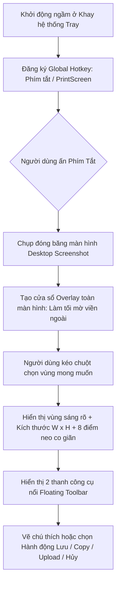

# Mô tả ứng dụng chụp màn hình

## 1. Nguyên Lý Hoạt Động (Architecture & Workflow)

Myshot hoạt động theo mô hình **Khay hệ thống (System Tray) + Lắng nghe phím tắt toàn cục (Global Hotkey Hook) + Lớp phủ toàn màn hình (Overlay Window)**.

### Chi Tiết Từng Bước Hoạt Động:

### Bước 1: Lắng nghe phím tắt (Global Hook)

- Ứng dụng chạy nền thu nhỏ dưới khay hệ thống (System Tray).
- Sử dụng hàm Win32 API (`RegisterHotKey`) để lắng nghe phím tắt toàn hệ thống dù người dùng đang ở bất kỳ phần mềm hay game nào.
- Hỗ trợ cả `DXGIODScreenshot.dll` để can thiệp chụp trực tiếp từ bộ đệm đồ họa DirectX (cho các ứng dụng đồ họa/game).

### Bước 2: Kích hoạt & Phủ lớp mờ (Screen Freeze & Dim Overlay)

- Ngay khi bấm phím tắt, Myshot lập tức chụp nhanh toàn bộ màn hình hiện tại (Desktop Snapshot) và lưu vào bộ nhớ RAM.
- Mở một cửa sổ full màn hình không viền (Frameless Topmost Window) đè lên tất cả các app khác.
- Phủ một lớp màu đen mờ (opacity khoảng 40-50%) lên toàn bộ ảnh chụp để tạo cảm giác màn hình dừng lại và tối đi, đồng thời đổi con trỏ chuột sang hình chữ thập kèm tooltip nhắc nhở *"Chọn vùng"*.

### Bước 3: Thao tác chọn vùng (Selection & Resizing)

- **Kéo chuột (Mouse Drag):** Người dùng giữ chuột trái và kéo để xác định tọa độ $(x, y, w, h)$.
- **Vùng chọn:** Vùng nằm trong hình chữ nhật sẽ được làm sáng rõ (trả lại độ sáng nguyên bản), viền ngoài vẫn giữ màu tối.
- **Kích thước:** Hiển thị tức thời chỉ số kích thước (ví dụ: `640 x 480`).
- **Co giãn/Di chuyển:** Sau khi thả chuột, 8 điểm neo (handles) xuất hiện ở 4 góc và 4 cạnh cho phép co kéo hoặc kéo rê cả vùng chụp đến vị trí khác.

### Bước 4: Thanh công cụ nổi (Floating Toolbars)

Khi vùng chọn được thả chuột, hai thanh công cụ nhỏ gọn lập tức xuất hiện bám sát theo mép ngoài của khung chữ nhật:

1. **Thanh công cụ chỉnh sửa (Nằm dọc bên phải khung chọn):**

   - **Bút vẽ (Pencil):** Vẽ tự do bằng tay.
   - **Đường thẳng (Line):** Kẻ đoạn thẳng.
   - **Mũi tên (Arrow):** Vẽ mũi tên chỉ dẫn nhanh.
   - **Khung chữ nhật (Rectangle):** Khoanh vùng đối tượng.
   - **Bút dạ quang (Marker / Highlighter):** Tô sáng văn bản mờ trong suốt.
   - **Văn bản (Text):** Gõ chữ trực tiếp lên ảnh. Cho phép điều chỉnh kích thước chữ
   - **Số thứ tự:** Cho phép thêm số thứ tự như văn bản định dạng trong khung tròn và tự động tăng khi thêm thêm và giảm khi xóa
   - **Bảng màu (Color Picker):** Đổi màu vẽ (mặc định đỏ).
   - **Hoàn tác (Undo):** Hủy bước vừa vẽ (`Ctrl + Z`) và quay lại bước vừa hủy (Ctrl + Y))
2. **Thanh hành động (Nằm ngang bên dưới khung chọn):**

   - **In ấn (Print):** Gửi ra máy in (`Ctrl + P`).
   - **Sao chép (Copy):** Sao chép trực tiếp dữ liệu ảnh vào Clipboard (`Ctrl + C`) để dán ngay vào Zalo, Messenger, Word,...
   - **Lưu ảnh (Save):** Lưu file ảnh về máy (`Ctrl + S`) định dạng PNG/JPG/BMP.
   - **Hủy bỏ (Close):** Tắt overlay, trở về màn hình làm việc bình thường (`Esc`).

---

## 3. Xây dựng thêm tính năng dịch

Nếu áp dụng cơ chế của Lightshot vào phần mềm **Dịch Màn Hình**, quy trình hoàn hảo sẽ là:

1. **Phím tắt nhanh:** Người dùng bấm 1 tổ hợp phím (ví dụ `F4` hoặc `Ctrl + Q` hoặc `Alt + D`).
2. **Overlay đóng băng:** Màn hình tối lại, cho phép người dùng khoanh vùng một đoạn phụ đề game, truyện tranh manga, file PDF hoặc tài liệu trên web.
3. **Thanh hành động thông minh (thay thế thanh Lightshot):**
   - Nút **"Dịch ngay" (Translate):** Cắt ảnh vùng đó $\rightarrow$ Đưa qua thư viện OCR (Tesseract / EasyOCR / RapidOCR / Windows Media OCR) $\rightarrow$ Dịch sang Tiếng Việt qua Google Translate / DeepL / Gemini API.
   - Nút **"Đè bản dịch lên ảnh" (Inpaint / Overlay Text):** Hiển thị chữ tiếng Việt dịch được đè đúng vị trí chữ gốc.
   - Nút **"Copy bản dịch":** Tự động sao chép văn bản đã dịch vào khay nhớ tạm.
