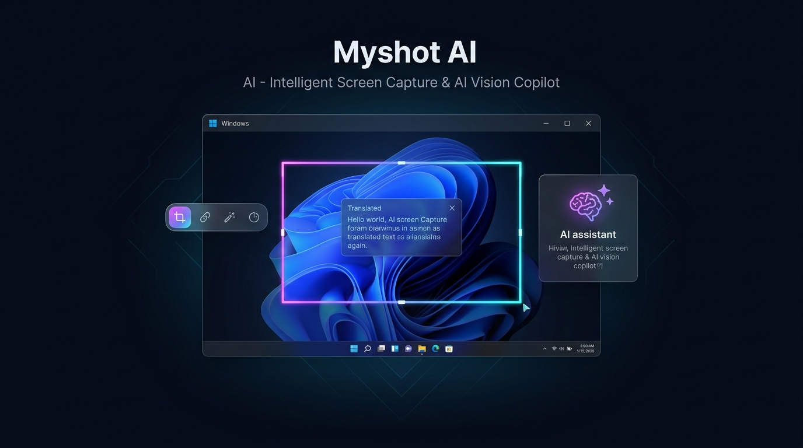
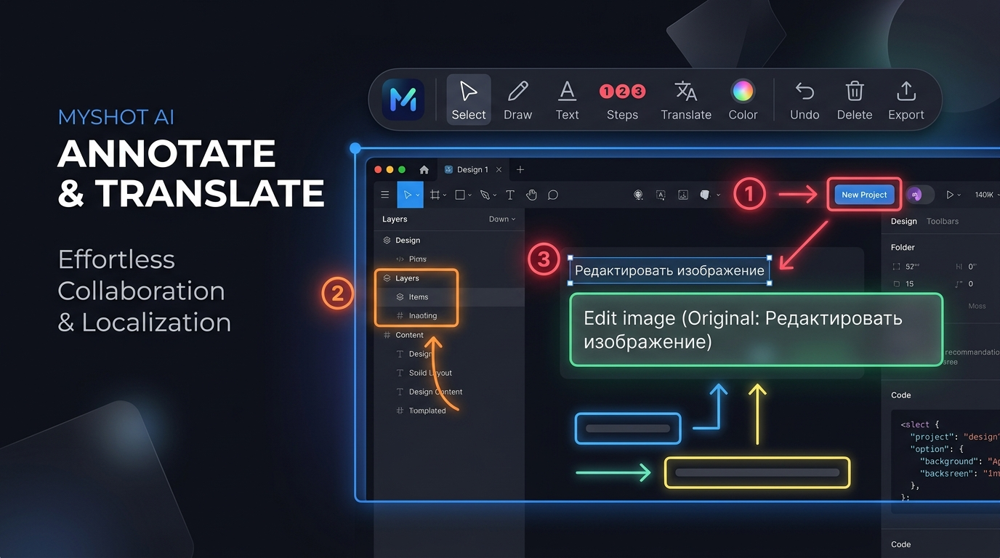
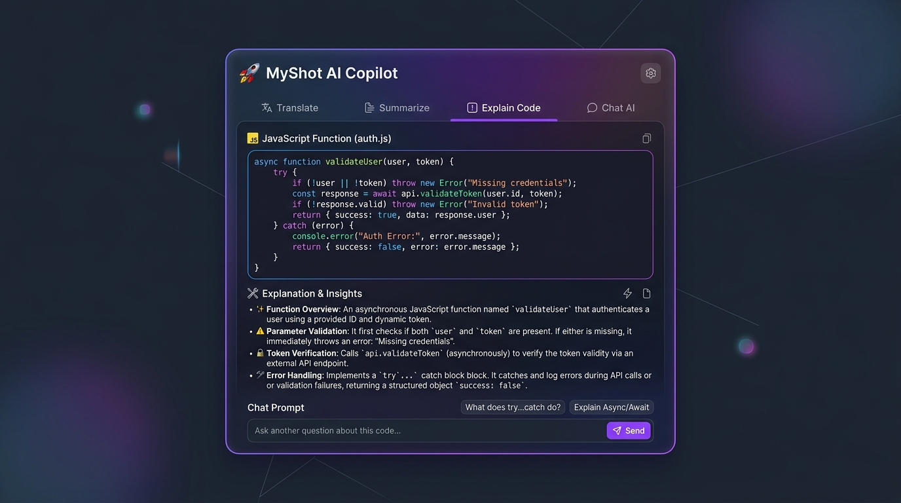

<div align="center">

# 🚀 Myshot AI
### Trợ Lý Chụp Màn Hình Thông Minh, Dịch Thuật Đa Phương Thức & AI Copilot

[](https://github.com/mynd02work-bit/Tool/stargazers)
[](https://github.com/mynd02work-bit/Tool)
[](https://www.python.org/)
[](https://riverbankcomputing.com/software/pyqt/)
[](https://aistudio.google.com/)
[](EasyCap/ex/LICENSE)

<br/>



<br/>
<br/>

**Sự kết hợp hoàn hảo giữa độ mượt mà của Lightshot và sức mạnh thị giác trí tuệ nhân tạo thế hệ mới (Gemini Vision Multimodal).**
<br/>
*Chụp ảnh siêu tốc • Dịch đè chữ 1:1 chuẩn thiết kế • Đánh số bước thông minh ❶ ❷ ❸ • Trợ lý AI Copilot giải code & tóm tắt tức thì*

<br/>

[✨ Tính Năng Nổi Bật](#-tính-năng-nổi-bật) •
[🎯 Trải Nghiệm & Demo](#-trải-nghiệm--demo-thao-tác) •
[⌨️ Phím Tắt Toàn Diện](#️-bảng-phím-tắt-toàn-diện) •
[🚀 Cài Đặt & Sử Dụng](#-cài-đặt--sử-dụng) •
[⚙️ Cấu Hình AI](#️-cấu-hình-api-key) •
[📂 Cấu Trúc Mã Nguồn](#-cấu-trúc-dự-án)

</div>

---

## 🌟 Giới Thiệu Tổng Quan

**Myshot AI** là công cụ chụp màn hình, chú thích đồ họa và trợ lý thị giác thông minh thế hệ mới dành riêng cho hệ điều hành **Windows**. 

Không chỉ dừng lại ở các tính năng cắt ảnh cơ bản thông thường, **Myshot AI** được thiết kế để giải quyết trọn vẹn những điểm đau đầu (pain points) lớn nhất của lập trình viên, học sinh, sinh viên, người dịch thuật và nhân viên văn phòng:

* 🔤 **Dịch đè trực tiếp 1:1 (In-place Inpaint):** Thay thế chữ nước ngoài trên ảnh bằng tiếng Việt (hoặc bất kỳ ngôn ngữ nào) ngay tại vị trí cũ, tự động xóa nền sạch sẽ, giữ nguyên layout gốc.
* 🤖 **AI Copilot thông minh (Raycast / Monica Style):** Khoanh chọn màn hình và hỏi đáp ngay lập tức — Giải thích đoạn code bị lỗi, dịch thuật ngữ chuyên sâu, tóm tắt bài báo nghiên cứu hoặc biểu đồ phức tạp.
* ❶ **Đánh số thứ tự quy trình (Step Badges ❶ ❷ ❸):** Tự động tăng số mỗi lần nhấp chuột, công cụ đắc lực nhất để làm tài liệu hướng dẫn (User Manual), tài liệu kỹ thuật hoặc báo lỗi (Bug Report).
* 🪟 **So sánh song ngữ & Dịch tài liệu (Dual Compare Viewer):** Hỗ trợ zoom & cuộn đồng bộ mượt mà hai màn hình trái/phải đối chiếu ảnh gốc và bản dịch.

---

## ✨ Tính Năng Nổi Bật

<div align="center">
  
</div>

### 1. 🎨 Bộ Công Cụ Chú Thích Màn Hình Chuẩn Pro (Lightshot++)
* **Thanh công cụ đôi (Dual Floating Pill Toolbar):** Tự động phát hiện vị trí biên màn hình, luôn căn chỉnh thông minh để không che khuất vùng chụp.
* **Vector Annotation mượt mà:**
  * ✏️ **Bút vẽ tự do (Pencil)**
  * ➡️ **Mũi tên chỉ dẫn (Arrow)** với đầu mũi tên vector sắc nét
  * 🔲 **Hình chữ nhật & Hình tròn / Elip** (Hỗ trợ phím `Shift` để vẽ hình vuông/tròn hoàn hảo)
  * 🖍️ **Bút dạ quang (Highlighter)** bán trong suốt làm nổi bật văn bản
  * 🔤 **Văn bản tùy biến (Text Box)** với khả năng chọn font, cỡ chữ và màu sắc
* **Huy hiệu số thứ tự tự động (Step Badge - ❶ ❷ ❸):** Tự động tăng dần số sau mỗi cú nhấp chuột; tự động giảm số khi bạn bấm <kbd>Ctrl</kbd> + <kbd>Z</kbd>.
* **Bảng màu RGB & Độ dày nét vẽ:** Lựa chọn màu sắc tức thì với thanh trượt trực quan.

---

### 2. 🔤 Dịch Đè Vị Trí Thông Minh 1:1 (Smart In-place Inpaint)
* **Tự động tẩy nền thông minh:** Phân tích màu nền cục bộ xung quanh văn bản gốc và lấp đầy vùng chọn tự nhiên, giữ nguyên họa tiết xung quanh.
* **Thuật toán Binary Search Auto Word-Wrap:** Tự động tính toán kích thước phông chữ lớn nhất có thể vừa khít trong khung gốc, đảm bảo tiêu đề to vẫn nổi bật và các đoạn văn bản dài không bị co ép xấu xí.
* **Chuyển đổi tức thì với phím <kbd>Tab</kbd>:** Nhấn <kbd>Tab</kbd> để lật tức thì giữa **[Ảnh Gốc]** ⮀ **[Bản Dịch]** để kiểm tra tính chính xác.

---

<div align="center">
  
</div>

### 3. 🤖 Trợ Lý AI Copilot Đa Phương Thức (Gemini Multimodal Vision)
* 💡 **Giải Thích & Sửa Lỗi Code (Explain Code):** Khoanh vùng đoạn code lỗi trong VS Code, IDE hoặc terminal ➔ Nhận ngay phân tích nguyên nhân và mã sửa lỗi.
* 📋 **Tóm Tắt 1-Chạm (Summarize):** Đọc nhanh nội dung trang web, tài liệu PDF, bài báo khoa học dài thành các gạch đầu dòng cốt lõi.
* 🌐 **Dịch Ngữ Cảnh Chuyên Sâu (Contextual Translate):** Dịch chính xác theo thuật ngữ ngành IT, Y học, Luật, Kinh tế hoặc phong cách Manga / Comic.
* 💬 **Chat Trực Tiếp Với Ảnh (Chat with Screen):** Đặt câu hỏi tiếp nối tự do về bất kỳ chi tiết, công thức toán học hoặc biểu đồ nào trên ảnh.

---

### 4. 🪟 Cửa Sổ So Sánh Song Song & Dịch Sách Báo (Dual Compare Viewer)
* **Hỗ trợ đa định dạng:** Mở trực tiếp ảnh chất lượng cao (`PNG`, `JPG`, `WEBP`, `BMP`).
* **Đồng bộ hóa 2 chiều:** Phóng to/thu nhỏ từ 10% đến 500%, cuộn trang mượt mà cùng lúc trên cả 2 màn hình Trái (Gốc) & Phải (Dịch).
* **Xuất bản đa năng:** Xuất riêng ảnh bản dịch hoặc ghép nối cả 2 ảnh thành một tệp đối chiếu song song.

---

## 🎯 Trải Nghiệm & Demo Thao Tác

### Quy trình 1: Chụp & Đánh Số Bước Hướng Dẫn Kỹ Thuật
```text
[Bấm F3] ➔ Màn hình phủ mờ ➔ Kéo chuột chọn khu vực cần hướng dẫn
   │
   ├── Chọn icon ❶ ➔ Click vào "Nút Đăng Ký"   ➔ Tự động tạo huy hiệu "❶"
   ├── Click tiếp vào "Ô Điền Email"         ➔ Tự động tạo huy hiệu "❷"
   ├── Click tiếp vào "Nút Xác Nhận OTP"     ➔ Tự động tạo huy hiệu "❸"
   │
   ├── Chọn ➡️ hoặc 🔲 để viền khung và chỉ điểm chi tiết
   └── Bấm [Ctrl + C] để copy gửi Slack/Zalo hoặc [Ctrl + S] để lưu file ảnh!
```

### Quy trình 2: Dịch Màn Hình 1:1 Giữ Nguyên Thiết Kế
```text
[Bấm F4] ➔ Kéo chuột quét khối văn bản tiếng Anh / Nhật / Hàn / Trung
   │
   ├── ⚡ OCR & AI phát hiện chính xác tọa độ từng dòng chữ
   ├── 🎨 Tự động xóa nền chữ gốc mượt mà
   ├── 📐 Tính toán cỡ chữ tối ưu bằng Auto-Fit Word Wrap
   └── ✨ Bản dịch tiếng Việt hiển thị đè đúng vị trí!
   │
   └── Bấm phím [TAB] ⮀ Lật qua lại xem ảnh gốc và bản dịch để so sánh
```

### Quy trình 3: Gọi Trợ Lý AI Copilot Phân Tích Màn Hình
```text
[Bấm F9] ➔ Khoanh chọn biểu đồ tài chính / đoạn code đang bug
   │
   ▼
┌─────────────────────────────────────────────────────────────┐
│ ✦ Myshot AI Copilot                                         │
├─────────────────────────────────────────────────────────────┤
│ [🌐 Dịch thuật]  [📋 Tóm tắt]  [💡 Giải thích]  [💬 Chat]   │
├─────────────────────────────────────────────────────────────┤
│  AI Phân Tích Chi Tiết:                                     │
│  "Đoạn code đang gặp lỗi NullReferenceException do biến user │
│   chưa được khởi tạo trước khi gọi .getName(). Khắc phục:"  │
├─────────────────────────────────────────────────────────────┤
│ [Nhập câu hỏi thêm về màn hình...]                 [Gửi ➔]  │
└─────────────────────────────────────────────────────────────┘
```

---

## ⌨️ Bảng Phím Tắt Toàn Diện

| Phím Tắt Mặc Định | Hành Động | Ghi Chú |
| :---: | :--- | :--- |
| <kbd>F3</kbd> | **Chụp ảnh màn hình (Lightshot Pro)** | Vẽ chú thích, đánh số bước ❶ ❷ ❸, viền khung, copy |
| <kbd>F4</kbd> | **Dịch màn hình đè 1:1** | Tự động OCR, tẩy nền và vẽ chữ dịch vào đúng vị trí |
| <kbd>F9</kbd> | **Gọi Trợ Lý AI Copilot** | Tóm tắt, giải thích code, dịch ngữ cảnh, chat với ảnh |
| <kbd>Tab</kbd> | **Lật ảnh siêu tốc** | Đổi qua lại giữa Bản dịch đè ⮀ Ảnh gốc |
| <kbd>Ctrl</kbd> + <kbd>C</kbd> | **Sao chép vào Clipboard** | Copy ảnh hoặc văn bản dịch |
| <kbd>Ctrl</kbd> + <kbd>S</kbd> | **Lưu file ảnh** | Hỗ trợ PNG, JPEG, WEBP, BMP |
| <kbd>Ctrl</kbd> + <kbd>Z</kbd> | **Hoàn tác (Undo)** | Hủy nét vẽ gần nhất hoặc lùi 1 số bước |
| <kbd>Ctrl</kbd> + <kbd>Y</kbd> | **Làm lại (Redo)** | Phục hồi lại thao tác vừa hủy |
| <kbd>Ctrl</kbd> + <kbd>P</kbd> | **In ảnh trực tiếp** | Mở hộp thoại in nhanh |
| <kbd>Esc</kbd> / `Chuột Phải` | **Hủy / Đóng chụp ảnh** | Thoát khỏi vùng chụp ngay lập tức |

> 💡 *Mẹo: Bạn có thể thay đổi tất cả các phím tắt theo ý thích trong menu Cài đặt `⚙️`.*

---

## 🚀 Cài Đặt & Sử Dụng

### Lựa Chọn 1: Chạy file `.EXE` độc lập (Khuyên dùng cho người dùng cuối)
1. Tải repository về hoặc tải trực tiếp file **[MyshotAI.exe](EasyCap/MyshotAI.exe)** trong thư mục `EasyCap/` (hoặc từ tab [Releases](../../releases)).
2. Nhấp đúp vào **`MyshotAI.exe`** để chạy trực tiếp ngay lập tức (Không cần cài đặt Python hay bất kỳ môi trường nào).
3. Ứng dụng sẽ tự động thu nhỏ vào **Khay hệ thống (System Tray)** dưới góc phải màn hình. Nhấn <kbd>F3</kbd>, <kbd>F4</kbd> hoặc <kbd>F9</kbd> để kích hoạt bất kỳ lúc nào!

---

### Lựa Chọn 2: Chạy từ mã nguồn Python (Dành cho Lập trình viên)

#### Yêu cầu hệ thống:
* Hệ điều hành: **Windows 10 / 11** (64-bit)
* Phiên bản: **Python 3.10** trở lên

#### Các bước cài đặt:
```bash
# 1. Clone repository về máy
git clone https://github.com/mynd02work-bit/Tool.git
cd Tool/EasyCap/ex

# 2. Cài đặt các thư viện phụ thuộc
pip install PyQt6 Pillow requests mss keyboard winocr

# 3. Khởi chạy ứng dụng
python main.py
```

Hoặc bạn có thể nhấp đúp vào file script tiện ích trong thư mục `EasyCap/ex/`:
* `cai_dat_thu_vien.bat` — Tự động kiểm tra và cài đặt toàn bộ thư viện.
* `run.bat` — Khởi chạy ứng dụng nhanh.
* `Chay_Myshot.vbs` — Khởi chạy ngầm không hiển thị cửa sổ console đen.

---

## ⚙️ Cấu Hình API Key & Mô Hình AI

Để sử dụng trọn vẹn sức mạnh của **Trợ lý AI Copilot**, bạn chỉ cần kết nối với **Google Gemini API** (hoàn toàn miễn phí):

1. Mở menu Cài đặt của **Myshot AI** bằng cách nhấp đúp vào icon dưới Khay hệ thống hoặc bấm biểu tượng `⚙️`.
2. Chuyển sang thẻ **🤖 Gemini AI**.
3. Điền **Gemini API Key**:
   * Nhận API Key miễn phí chỉ sau 1 phút tại: [Google AI Studio](https://aistudio.google.com/app/apikey).
4. Lựa chọn mô hình AI phù hợp:
   * `gemini-2.0-flash` *(Khuyên dùng)*: Phản hồi cực nhanh, khả năng hiểu hình ảnh xuất sắc.
   * `gemini-1.5-pro`: Suy luận logic chuyên sâu với các bài toán và tài liệu kỹ thuật phức tạp.
5. Bấm nút **`⚡ Kiểm Tra Kết Nối`** ➔ Nhấn **`Lưu Cài Đặt`**.

---

## 📂 Cấu Trúc Dự Án

```text
├── README.md                   # Tài liệu giới thiệu & hướng dẫn chi tiết
├── .gitignore                  # Cấu hình bỏ qua tệp tạm và bảo mật
└── EasyCap/                    # Thư mục chính của ứng dụng
    ├── MyshotAI.exe            # File thực thi độc lập (Chạy trực tiếp không cần Python)
    ├── assets/                 # Banner, mockup AI Copilot & logo
    │   ├── hero_banner.jpg
    │   ├── feature_annotation.jpg
    │   ├── feature_copilot.jpg
    │   ├── team_logo.png
    │   └── donate_qr.png
    ├── ex/                     # Các file script thực thi & cấu hình phụ trợ
    │   ├── main.py             # Entry point khởi chạy
    │   ├── myshot_config.json  # File cấu hình ứng dụng
    │   ├── MyshotAI.spec       # File cấu hình đóng gói PyInstaller
    │   ├── cai_dat_thu_vien.bat # Script tự động cài thư viện Python
    │   ├── run.bat             # Script khởi chạy nhanh
    │   ├── Chay_Myshot.vbs     # Khởi chạy ngầm không hiện console
    │   ├── app_icon.ico        # Icon ứng dụng
    │   └── LICENSE             # Giấy phép MIT
    └── src/                    # Toàn bộ mã nguồn phần mềm
        ├── __init__.py
        ├── main.py             # Khởi tạo ứng dụng & Hotkeys
        ├── overlay.py          # Lớp phủ màn hình chụp ảnh & canvas
        ├── floating_toolbar.py # Thanh công cụ nổi thông minh (Bút, Mũi tên, Đánh số bước...)
        ├── canvas_elements.py  # Vector graphics & Auto Word-Wrap font fitting
        ├── ai_copilot_card.py  # Thẻ giao diện AI Copilot (Raycast/Monica style, Markdown)
        ├── ai_engine.py        # Kết nối Google Gemini Multimodal Vision API
        ├── translation_card.py # Thẻ hiển thị bản dịch nhanh & đối chiếu song ngữ
        ├── dual_compare_window.py # So sánh song song 2 ảnh & cuộn/zoom đồng bộ
        ├── document_translator.py # Xử lý dịch tài liệu & batch images
        ├── document_translator_dialog.py # Hộp thoại dịch tài liệu
        ├── ocr_translate.py    # Windows OCR Engine & Google Translation
        ├── settings_dialog.py  # Cài đặt phím tắt, đường dẫn, màu sắc & API Key
        ├── about_dialog.py     # Giới thiệu thông tin phần mềm & nhà phát triển
        ├── config.py           # Quản lý cấu hình JSON
        ├── infographic_renderer.py # Render infographic
        ├── line_icons.py       # Bộ icon đồ họa vector
        └── main_window.py      # Thanh điều khiển nhỏ trên màn hình
```

---

## 🛠️ Đóng Gói Ứng Dụng Thành File `.EXE`

Nếu bạn muốn tự đóng gói mã nguồn thành file thực thi duy nhất:

```bash
pip install pyinstaller
pyinstaller MyshotAI.spec --clean
```

File thực thi độc lập sẽ được tạo ra tại thư mục `dist/MyshotAI.exe`.

---

## 💖 Đóng Góp & Hỗ Trợ Dự Án

Dự án được xây dựng với mục tiêu mang đến trải nghiệm chụp màn hình và dịch thuật AI miễn phí, mạnh mẽ và tiện lợi nhất cho cộng đồng người dùng Việt Nam. 

Nếu thấy phần mềm hữu ích, hãy tặng cho dự án **1 Star ⭐ trên GitHub** để ủng hộ tác giả nhé!

<div align="center">
  
  <p><i>Cảm ơn mọi sự ủng hộ và đồng hành của bạn!</i></p>
</div>

---

## 📄 Bản Quyền (License)

Dự án được phát hành theo giấy phép [MIT License](EasyCap/ex/LICENSE). Bạn hoàn toàn có thể tự do sử dụng, chỉnh sửa và phân phối cho mục đích cá nhân hoặc thương mại.

<div align="center">
  <b>Myshot AI</b> — <i>Crafted with ❤️ for high productivity and seamless AI workflow.</i>
</div>
